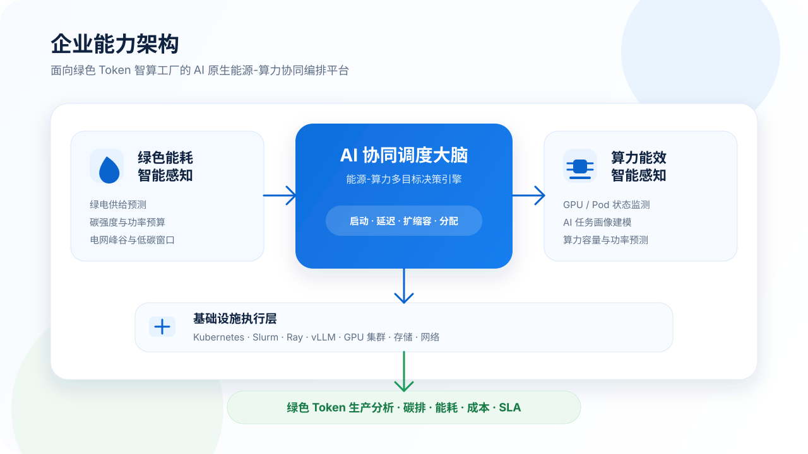
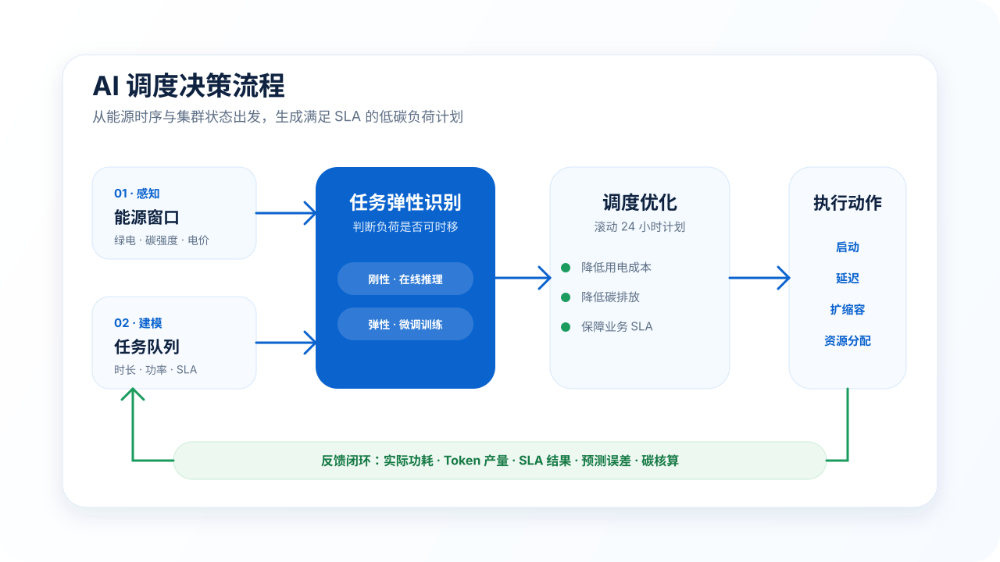
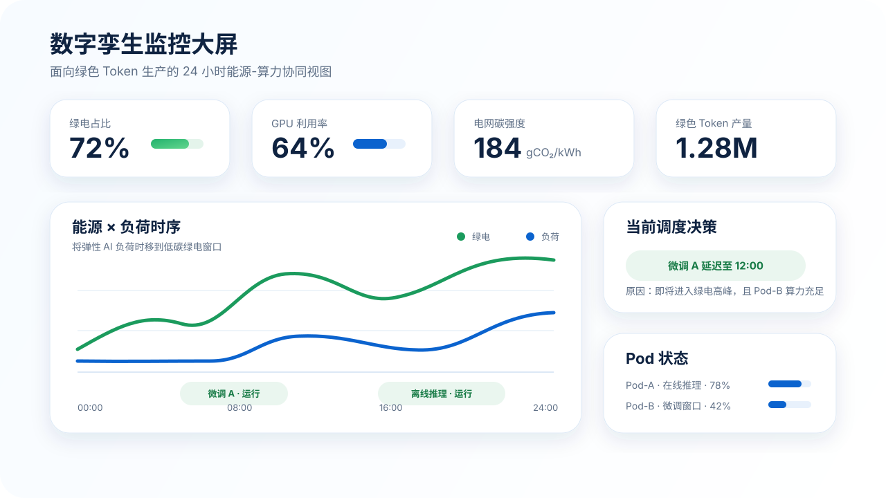

<div align="center">

# GreenPulse

### 面向绿色 Token 智算工厂的 AI 原生能源-算力协同编排平台

*让 AI 负荷主动匹配绿电时序，构建下一代绿色 AI 数据中心。*

</div>

---

## 项目一句话

GreenPulse 是一个面向下一代绿色 AI 数据中心的能源-算力-AI 协同调度框架，通过融合未来 24 小时绿电、电价、碳强度、GPU 资源与 AI 任务画像，在保障业务 SLA 与任务 Deadline 的前提下，将高耗能弹性任务主动调度到低碳绿电窗口，实现更低碳、更低成本、更高效的绿色 Token 生产。

---

## 为什么需要 GreenPulse？

当前 AI 数据中心的调度逻辑通常围绕 GPU 可用性、任务队列和吞吐量展开，但很少把能源时序纳入核心决策。

现实中，风光绿电具有波动性，电网碳强度和分时电价也会随时间变化。如果高耗能训练、微调、离线推理等任务持续按照“有资源就运行”的方式执行，就容易出现：

- 绿电高峰时算力负荷不足，绿色能源无法充分消纳；
- 电网高峰或火电占比较高时，大量高耗能 AI 任务集中运行；
- GPU 调度、能源供给和业务 SLA 三者之间缺少统一决策；
- 数据中心仍停留在“售卖算力资源”，而不是“经营绿色 Token 产能”。

GreenPulse 的核心问题意识是：

> 传统调度器问：**现在哪块 GPU 空闲？**
>
> GreenPulse 问：**这个 AI 任务应该在什么时候、用哪部分算力运行，才能生产更绿色的 Token？**

---

## 核心图

### ① 能力架构



### ② AI 调度决策流程



### ③ 数字孪生监控大屏



---

## 项目定位

GreenPulse 是一个 Research Prototype，目标不是从零重建完整数据中心操作系统，而是聚焦一个可落地、可演示、可量化的问题：

> **AI 负荷调度未结合能源时序特性，导致高能耗任务与电网高峰、火电时段错配。**

因此，GreenPulse 采用“三模块协同”的架构：

1. **绿色能耗智能感知**：预测未来绿电比例、电价、碳强度、电网峰谷和可用功率预算；
2. **算力能效智能感知**：监测 GPU 集群、Pod 负载、资源可用性和任务执行画像；
3. **AI 协同调度大脑**：联合优化任务启动、延迟、扩缩容和资源分配策略。

---

## 核心思想

GreenPulse 将可延迟 AI 任务视为一种“虚拟储能”。

也就是说，与其强行要求波动的绿电去持续匹配 7×24 小时 AI 负荷，不如让具备弹性的 AI 负荷主动跟随绿电窗口运行。

适合调度的弹性任务包括：

- 模型训练
- 微调任务
- 离线推理
- Embedding 生成
- 模型评测
- 数据预处理

而在线推理、实时推荐、低延迟 API 等刚性任务，则继续受到 SLA 约束保护，不会为了节能而牺牲核心业务体验。

---

## 企业能力架构

```text
┌─────────────────────────────────────────────────────────────────────┐
│                         GreenPulse Platform                         │
│              AI 原生能源-算力协同调度与绿色 Token 生产平台             │
└─────────────────────────────────────────────────────────────────────┘

┌──────────────────────────────┐      ┌──────────────────────────────┐
│        绿色能耗智能感知        │      │        算力能效智能感知        │
│                              │      │                              │
│ • 绿电供给预测                │      │ • GPU / Pod 状态监测           │
│ • 电网碳强度                  │      │ • AI 任务画像建模              │
│ • 分时电价                    │      │ • 算力资源预测                 │
│ • 电网峰谷状态                │      │ • 集群功率估算                 │
│ • 可用功率预算                │      │ • 容量约束建模                 │
└───────────────┬──────────────┘      └───────────────┬──────────────┘
                │                                     │
                │ 能源时序信号                         │ 算力时序信号
                └──────────────────┬──────────────────┘
                                   ▼
┌─────────────────────────────────────────────────────────────────────┐
│                         AI 协同调度大脑                              │
│                                                                     │
│                    多目标调度优化与决策引擎                           │
│                                                                     │
│       • 启动 / 延迟 / 恢复 / 扩缩容 / 资源分配                         │
│       • SLA 约束下的任务规划                                          │
│       • 碳感知调度                                                   │
│       • 滚动 24 小时优化                                              │
└──────────────────────────────────┬──────────────────────────────────┘
                                   ▼
┌─────────────────────────────────────────────────────────────────────┐
│                         基础设施执行层                                │
│              Kubernetes · Slurm · Ray · vLLM · GPU Cluster           │
└──────────────────────────────────┬──────────────────────────────────┘
                                   ▼
┌─────────────────────────────────────────────────────────────────────┐
│                         绿色 Token 生产分析                           │
│                    Token · Carbon · Energy · Cost · SLA              │
└─────────────────────────────────────────────────────────────────────┘
```

---

## 核心模块

### 绿色能耗智能感知

该模块将不确定的能源侧信息转换为可调度的时间窗口和功率边界。

输入数据：

- 天气预测
- 光伏发电预测
- 风电发电预测
- 分时电价
- 电网碳强度
- 电网负荷状态
- 储能状态

输出数据：

| 输出 | 说明 |
| --- | --- |
| 绿电比例 | 每个时间窗口中可再生能源的预计占比 |
| 可用功率预算 | 可分配给 AI 负荷的最大功率 |
| 碳强度 | 单位电力对应的碳排放 |
| 电价 | 分时用电成本 |
| 电网状态 | 高峰、平峰或低谷 |
| 预测置信度 | 能源预测结果的可靠性 |

---

### 算力能效智能感知

该模块将集群侧信息转换为任务约束、容量约束和功率约束。

集群信号：

- GPU 利用率
- GPU 显存占用
- GPU 功耗
- Pod 负载
- 网络状态
- 当前任务队列
- 资源预约情况

任务画像：

| 属性 | 说明 |
| --- | --- |
| GPU 需求 | 所需 GPU 数量和类型 |
| 预计运行时间 | 任务预计执行时长 |
| 预计功率 | 任务运行时的功耗估计 |
| Deadline | 最晚完成时间 |
| SLA | 业务服务质量约束 |
| 可延迟性 | 是否允许时移执行 |
| 可中断性 | 是否支持暂停与恢复 |
| Token 产量 | 预计产生的 Token 数量 |
| Token/Joule | 单位能耗 Token 产出效率 |

---

### AI 协同调度大脑

AI 大脑是 GreenPulse 的核心决策层。

它综合考虑：

- 未来绿电窗口
- 电价与碳强度
- GPU 与 Pod 可用性
- 任务运行时长与功耗
- SLA 与 Deadline 约束
- Token 产出效率

示例调度决策：

```json
{
  "job": "FineTune-A",
  "action": "delay",
  "start_time": "12:00",
  "end_time": "15:00",
  "target_pod": "Pod-B",
  "allocated_gpus": 64,
  "reason": "高绿电比例且 Pod-B 算力充足",
  "expected_carbon_reduction": "28%"
}
```

---

## 调度优化目标

GreenPulse 将能源、碳排、算力和业务约束统一建模。

```text
最小化：

α · 用电成本
+ β · 碳排放
+ γ · SLA 违约惩罚
+ δ · 峰值功率惩罚
+ ε · 迁移 / 重启成本
```

约束条件：

- SLA 约束
- 任务 Deadline 约束
- GPU 容量约束
- Pod 功率预算约束
- 绿电可用性约束
- 任务依赖关系约束

---

## MVP 实现计划

第一阶段不直接接入真实生产集群，而是先构建一个可控的 Digital Twin Simulator，用来验证调度逻辑和量化收益。

### MVP 范围

- 1 个虚拟 AI 数据中心
- 3 个虚拟计算 Pod
- 3 类任务：在线推理、微调训练、离线推理
- 24 小时能源预测曲线
- 15 分钟调度粒度
- 支持动作：启动、延迟、资源分配、扩缩容

### 原型流程

```text
能源预测
   │
   ▼
算力预测
   │
   ▼
任务队列
   │
   ▼
GreenPulse Scheduler
   │
   ▼
24 小时任务执行计划
   │
   ▼
评测与可视化大屏
```

---

## 评测设计

GreenPulse 将与多个基础调度策略进行对比。

Baseline：

- FIFO：任务到达后，只要资源可用就立即运行；
- Price-only：只按照低电价窗口调度可延迟任务；
- Carbon-only：只按照低碳窗口调度可延迟任务；
- GreenPulse：联合优化能源、算力、SLA 与任务约束。

评价指标：

| 指标 | 目标 |
| --- | --- |
| 总碳排放 | 降低 |
| 总用电成本 | 降低 |
| 绿电消纳率 | 提升 |
| 峰值功率 | 降低 |
| GPU 利用率 | 提升 |
| SLA 达成率 | 提升 |
| 平均任务等待时间 | 可控 |
| Token/Joule | 提升 |
| 单位 Token 碳排 | 降低 |

---

## Roadmap

- [ ] 构建 24 小时绿电与碳强度合成数据集
- [ ] 构建虚拟 GPU Pod 与任务模拟器
- [ ] 实现 AI 任务画像模块
- [ ] 实现 FIFO / Price-only / Carbon-only Baseline
- [ ] 实现 GreenPulse 多目标调度器
- [ ] 生成 24 小时任务调度时间线
- [ ] 增加碳排、电费、绿电消纳率等评测指标
- [ ] 构建数字孪生 Dashboard 原型
- [ ] 设计 Kubernetes / Slurm 执行适配层
- [ ] 增加绿色 Token 碳核算模块

---

## 建议仓库结构

```text
green-token-orchestrator/
├── README.md
├── docs/
│   ├── architecture.md
│   ├── project_plan.md
│   └── evaluation.md
├── energy/
│   └── renewable_forecast.py
├── compute/
│   └── cluster_simulator.py
├── scheduler/
│   ├── baselines.py
│   └── greenpulse_scheduler.py
├── simulator/
│   └── run_simulation.py
├── dashboard/
│   └── app.py
├── configs/
│   └── demo.yaml
└── assets/
    ├── business-capability-architecture.svg
    ├── ai-brain-decision-flow.svg
    └── digital-twin-dashboard.svg
```

---

## 愿景

AI 不应只优化计算本身。

AI 也应该根据能源供给来编排计算。

GreenPulse 希望成为未来绿色 Token 智算工厂的智能调度层，推动 AI 数据中心从“售卖 GPU 资源”升级为“经营低碳数字产能”。

---

## License

MIT License
